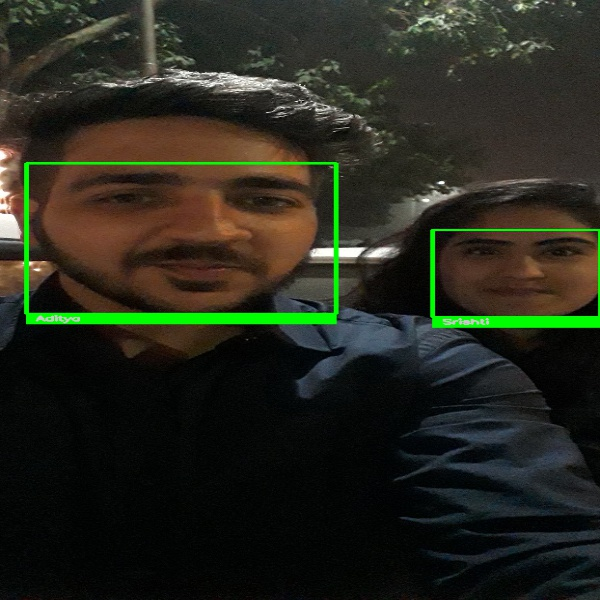
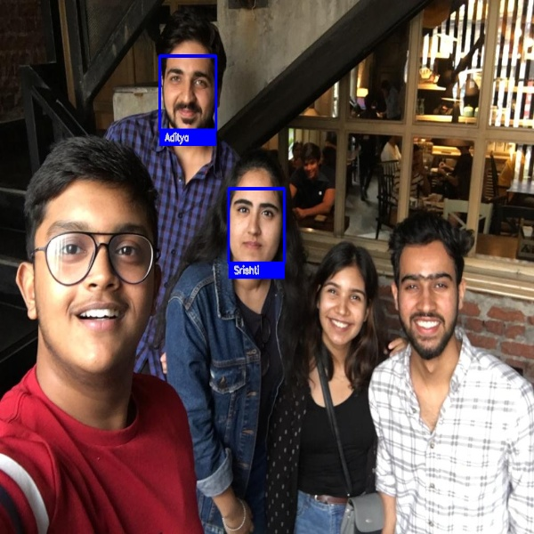
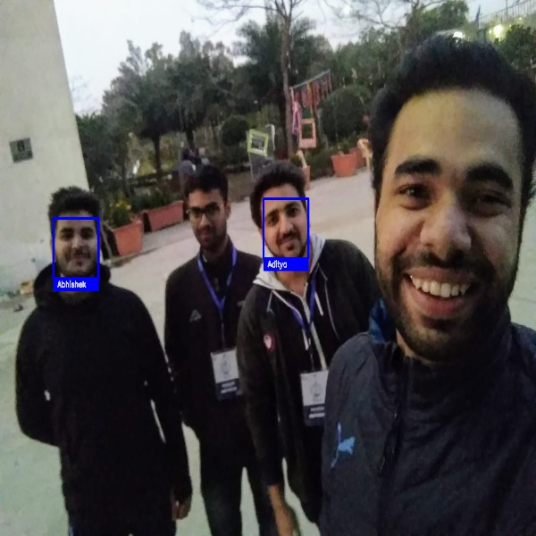

# Facial-Recognition-Project

- Credits: [Adam Geitgey](https://github.com/ageitgey/face_recognition)

- The main directory is face-identification-project but it is preferable to understand facial landmark detection first in order to execute the recognition part.

This project is completed using [face_recognition](https://pypi.org/project/face-recognition/) package. This package is compatible with [DLIB](https://pypi.org/project/dlib/) Library.

- There are two jupyter notebooks in the face-identification directory:

## [face-identification](https://github.com/adityakalra581/Facial-Recognition-Project/blob/master/face_identification.ipynb) [Built on Google Colab]

- Advantages on Colab:

1. GPU: Greater computing power, therefore better experience and faster results.

2. No need for Dependencies Installment: In colab there is no need of installing dependencies.

- Disadvantages:

1. Quite rigid for OpenCV: There are certain restrictions in Colab while using OpenCV.

2. No webcam Control: No alternate of controlling webcam using OpenCV in google colab, although you can just capture an image.

## [Face-Identification](https://github.com/adityakalra581/Facial-Recognition-Project/blob/master/Face-Identification%20.ipynb) [Built on Local Machine]
 
- Disadvantages on Local Machine:

1. CPU: Less computing power therefore, "cnn" model is to be replaced with "hog"

2. Dependencies Installment: Packages need to install: OpenCV, face_recognition and also face_recognition is not officialy compatible with Windows but there ways to install it.

- Advantages:

-  Once everything is installed the process is smooth.

### SAMPLE OUTPUTS:

### Installing face_recognition package on Windows machine:

**For working on Local Machine**

**Step1:** Download and install python 3.8 or higher **(64 bit)**

- visit [Python Downloads](https://www.python.org/downloads/windows/) and `Download Windows x86-64 executable installer`.

- **Note:** 

**1. 32 bit for this project is useless.**

**2. While installing python tick ADD to PATH checkbox**

**Step2:** Installing [Microsoft Build Tools](https://visualstudio.microsoft.com/visual-cpp-build-tools/)

**Step 3:** pip install cmake.

**Step3:** Installing [face_recognition](https://pypi.org/project/face-recognition/) Package

There is no need to install Dlib Explicitly as face_recognition package comes along with this.

This is the best Video Tutorial I have seen.

### References:

**1. [face recognition installation for windows.](https://youtu.be/xaDJ5xnc8dc)** 

**2. [I have used this earlier to resort cmake error.](https://youtu.be/TC_LPpa7uj0)**

